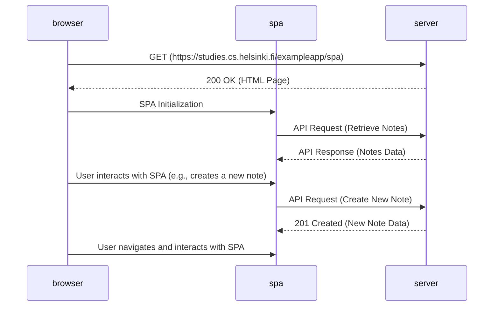

```mermaid

sequenceDiagram
    participant browser
    participant spa
    participant server

    browser->>server: GET (https://studies.cs.helsinki.fi/exampleapp/spa)
    server-->>browser: 200 OK (HTML Page)

    browser->>spa: SPA Initialization
    spa->>server: API Request (Retrieve Notes)
    server-->>spa: API Response (Notes Data)

    browser->>spa: User interacts with SPA (e.g., creates a new note)
    spa->>server: API Request (Create New Note)
    server-->>spa: 201 Created (New Note Data)

    browser->>spa: User navigates and interacts with SPA


```