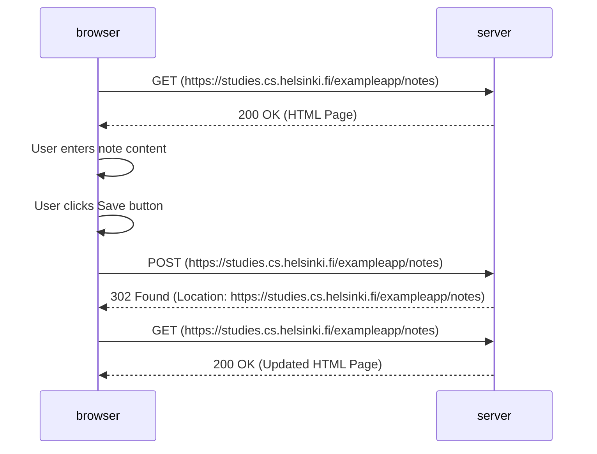

```mermaid

sequenceDiagram
    participant browser
    participant server

    browser->>server: GET (https://studies.cs.helsinki.fi/exampleapp/notes)
    server-->>browser: 200 OK (HTML Page)

    browser->>browser: User enters note content
    browser->>browser: User clicks Save button

    browser->>server: POST (https://studies.cs.helsinki.fi/exampleapp/notes)
    server-->>browser: 302 Found (Location: https://studies.cs.helsinki.fi/exampleapp/notes)
    browser->>server: GET (https://studies.cs.helsinki.fi/exampleapp/notes)
    server-->>browser: 200 OK (Updated HTML Page)


```