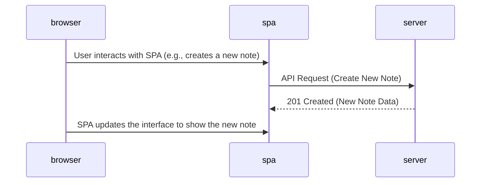

```mermaid

sequenceDiagram
    participant browser
    participant spa
    participant server

    browser->>spa: User interacts with SPA (e.g., creates a new note)
    spa->>server: API Request (Create New Note)
    server-->>spa: 201 Created (New Note Data)

    browser->>spa: SPA updates the interface to show the new note

```